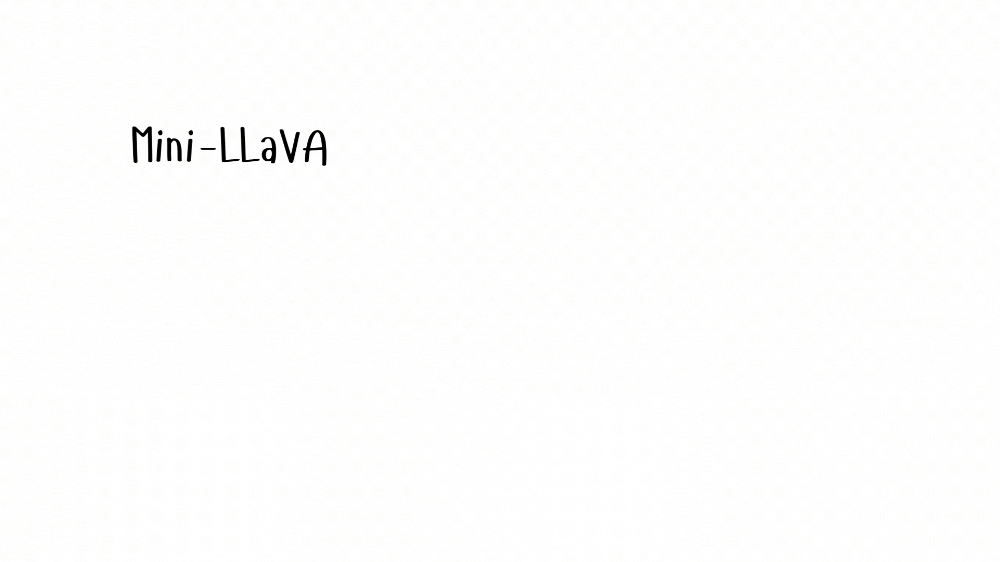

<!-- <div style="display: flex; align-items: center; margin-bottom: 20px;"> -->
<div align="center">
  
</div>
<div align="center">
  
  <p><em>Mini-LLaVA handles text, image and video inputs.</em></p>
</div>

Welcome to Mini-LLaVA – a minimal and seamless implementation of LLaVA-style vision language model, which unlock multimodal ability of a Large Language Model (based on Llama-3.1) with just a single GPU.

This project goes above and beyond the original by introducing powerful support for interleaved processing of multiple input types—including images, videos, and text—all respecting their order of appearance. Whether you're handling complex visual-textual correlations or want seamless transitions between media formats, Mini-LLaVA has you covered with minimal code and maximum flexibility.


## 🔥 Updates
- [09/2024] [Minimal Implementation] [Tutorial in Mini_LLaVA.ipynb](Mini_LLaVA.ipynb) showing how a pre-trained adaptor could helps Llama3.1 to see.


## 💡 Features
- Minimal Code Structure: Transform a language model (Llama 3.1) into a powerful vision-language model with minimal, easy-to-understand code.
- Simplified Implementation: Our code is significantly simpler than the original LLaVA implementation, making it easier to dive into and build upon.
- Extended Functionality: We've added support for interleaved processing of images, videos, and text, giving you more flexibility and power.

## 🚧 TODO 
- [ ] Fine-tune on language decoder
- [ ] Audio modality
- [ ] Retrieval modality
- [ ] Benchmark inference test


## Environment Set-up
```shell
run set.sh
```


