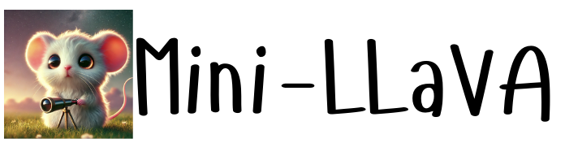
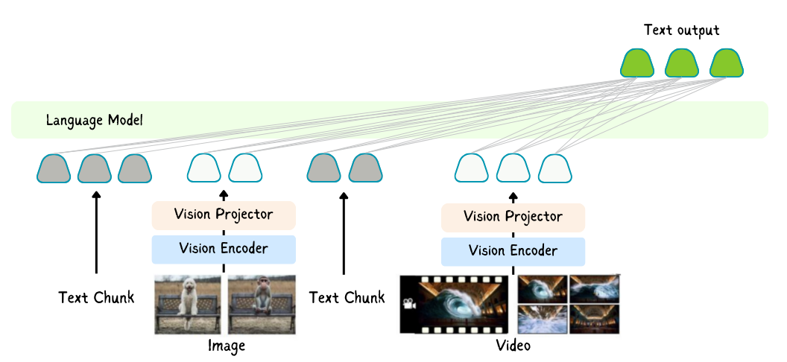

<!-- <div style="display: flex; align-items: center; margin-bottom: 20px;"> -->
<div align="center">
  
</div>

<div align="center">
  
  <p><em>Mini-LLaVA handles text, image and video inputs.</em></p>
</div>


Mini-LlaVA is a lightweight implementation of the LLaVA model, designed to unlock multimodal capabilities of Large Language Models (LLMs) using a single GPU. This project extends the original LLaVA concept by enabling interleaved processing of multiple images, videos, and text inputs respecting their order of appearance.

## Features

- Minimal implementation of LLaVA
- Interleaved processing of multiple modalities of any number, obeying order of their inputs:
  - Images
  - Videos
  - Text
- Jupyter notebook for easy experimentation and learning

## Environment Set-up
```shell
run set.sh
```
